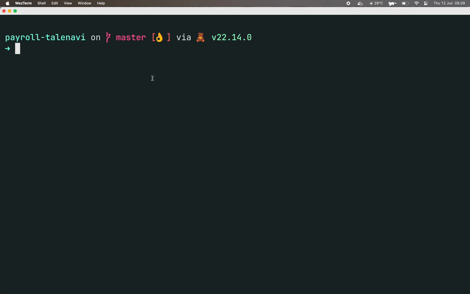
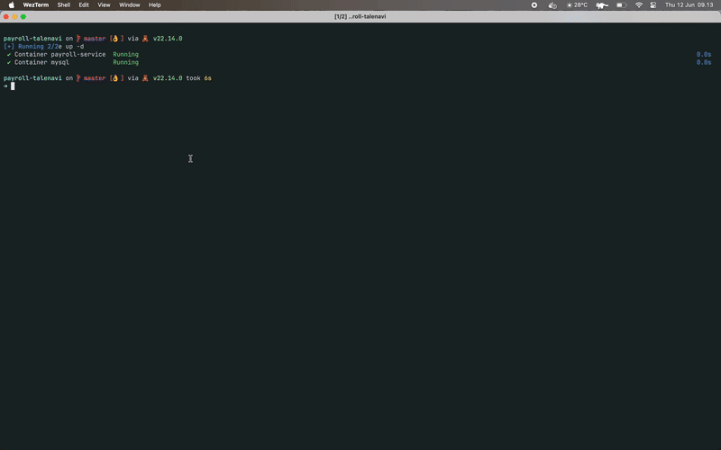
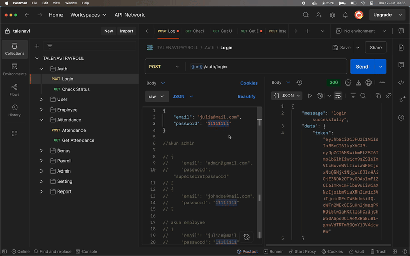

### 👩‍💻 1. Menjalankan service

### 🧪 2. Registrasi & Autentikasi

### 👩‍💼 3. Manajemen Karyawan

### 🕒 4. Absensi Harian

### 🎁 5. Setup Bonus

### 💳 6. Create Payroll

### ⚙️ 7. Setup Setting

### 📄 8. Download Report

